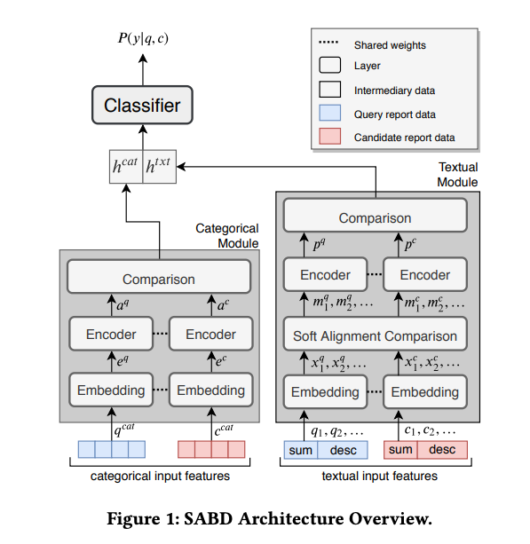

# SABD Replication

## About

### Overview
I augmented this replication package from https://github.com/soarsmu/TOSEM-DBRD, to be a baseline for a novel, multi-modal, duplicate bug report detection machine learning technique. SABD or Soft Alignment Model For Bug Duplication, is a multilayer deep learning network based on soft-attention alignment which takes a candidate bug report, that has been previously submitted to the model, and a new query bug report as input, and outputs the probability that the query report is a duplicate of the candidate report. First, SABD runs the two input reports through two sub-networks, one that considers categorical information (such as report severity or report type) and the other that considers purely textual information. Then, It combines the scores from the two sub-networks and feeds the result to a binary classifier that returns 1 if the bug reports are duplicates and 0 if they are not. You can see a diagram of the projects architecutre below. 

Picture of SABD Architecture from: https://irving-muller.github.io/papers/MSR2020.pdf


### Process
First, I fixed existing replication package bugs and recommented the code for clarity. Then, I tested the full replication package pipeline and recorded intermediary outputs, to understand any incompatibilities with my Lab's GitHub issue data. The initial package trained an SABD model on bugs from the Mozilla Info Tracking System, where report structure and tracked categorical infromation differs from GitHub, so I updated the pipeline to train SABD models on 14,000 GitHub issues. Next, I edited the evaluation phase of the package pipline to properly save trained models and export raw results, instead of only metrics, so that SABD results could be processed externally along with other project results. Finally, I built a data preprocessing pipeline that traversed my Lab's structured bug report data and converted it into the compatible format for the replication repository. 

## Setup
### Downloading Anaconda and Creating Environment
1. Follow steps here to download latest version of Anaconda, https://docs.anaconda.com/anaconda/install/linux/
2. Create tosem environment: 
```sh 
conda env create -f environment.yml 
``` 
### Glove
1. Clone gove repository into SABD directory, this subfolder is downloaded from [stanfordnlp/glove](https://github.com/stanfordnlp/GloVe/).
```sh
git clone https://github.com/stanfordnlp/GloVe glove
```
2. Install Make
```sh
apt-get update & apt-get install cmake
```
3. Allow and run demo.sh with your project name, see sample demo.sh for Mozill
```sh
chmod 777 demo.sh
./demo.sh Mozilla
```
4. Download glove.42B.300d into word_embedding directory and unzip
```sh
wget http://nlp.stanford.edu/data/glove.42B.300d.zip
unzip glove.42B.300d.zip
```

## Step-by-step Saved Model Inference Example
1. Create a new json_parameters file using those given as an example, only change test_bug_database, bug_database, database name and recall_rate/dataset cattegories. Be sure to follow the naming conventions used by the example json_parameter files given. The other information is purely used for creating a cache in this experiment.
2. Transform your GitHub extracted json issues into a single jsonl file
```
python3 /scratch/projects/sam/repos/SABD_Replication_SB/data_processing/json_to_jsonl.py --project_name [your_project_name] --project_path [the_path_to_your_json_issues]
```
3. Create test set
```
python data/create_testset_json.py --project_name [your_project_name]  --project_path [the_path_to_your_json_issues] --dev_perc=0.05
```
4. SoftClean jsonl bug database file
```
python data/clean_data_sea_pipeline.py --project_name [your_project_name] --project_path [the_path_to_your_project] --fields short_desc description --type soft --rm_punc --lower_case --rm_number --stop_words --stem --rm_char
```
5. Use saved SABD model for inference on your data
```
CUDA_VISIBLE_DEVICES=0 python experiments/sabd_load_test.py -F ./experiments with ./json_parameters/[name_of_your_json_parameters_file] "recall_rate.window=365"
```
### Script for Saved Model Inference
You may wish to run all these commands together on your data, for that you can use the bash script below. Make sure to follow step one above for your data prior to running the script.

```
bash load_and_inference_SABD.sh [your_project_name] [path to your project] [name of your json parameter file]
```

## Step-by-step Mozilla Excecution Example, Original TOSEM Pipeline
1. Activate tosem Enviroment
```sh
conda activate tosem
```
2. Create Datasets
```sh
python3 data/create_dataset_our_methodology_json.py --json_file ../dataset/mozilla/mozilla.json --database mozilla --bug_data ../dataset/mozilla/mozilla.json --training ../dataset/mozilla/training_split_mozilla.txt --validation ../dataset/mozilla/validation_mozilla.txt --test ../dataset/mozilla/test_mozilla.txt --date="2020/01/01" --no_tree --dev_perc=0.05
```
3. Clean Data
```sh
python3 data/clean_data.py --bug_dataset ../dataset/mozilla/mozilla.json --output ../dataset/mozilla/mozilla_soft_clean.json --fields short_desc description --type soft --rm_punc --lower_case --rm_number --stop_words --stem --rm_char
```
4. Generate Training and Validation Pairs
```sh
 python3 data/generate_pairs_triplets.py --bug_data ../dataset/mozilla/mozilla.json --dataset ../dataset/mozilla/training_split_mozilla.txt --n 1 --type random
```
```sh
 python3 data/generate_pairs_triplets.py --bug_data ../dataset/mozilla/mozilla.json --dataset ../dataset/mozilla/validation_mozilla.txt --n 1 --type random
```
5. Union Train_split and Valid to Train
```sh
python3 util/join_training_validation.py -ts ../dataset/mozilla/training_split_mozilla.txt -tsp ../dataset/mozilla/training_split_mozilla_pairs_random_1.txt -v ../dataset/mozilla/validation_mozilla.txt -vp ../dataset/mozilla/validation_mozilla_pairs_random_1.txt -t ../dataset/mozilla/training_mozilla.txt  -tp ../dataset/mozilla/training_mozilla_pairs_random_1.txt
```
6. Generate Categorical Lexicon
```sh
python3 data/generate_categorical_lexicon.py --bug_data ../dataset/mozilla/mozilla.json -o ../dataset/mozilla/categorical_lexicons.json
```
7. Generate Glove Embeddings
```sh
python3 util/create_dataset_word_embedding_json.py --training ../dataset/mozilla/training_split_mozilla.txt --bug_database ../dataset/mozilla/mozilla.json --output word_embedding/mozilla/mozilla_soft_clean.txt --clean_type soft 
```
8. Make Glove Embeddings
* First, change path ways for corpus, vocab_file, cooccurence_file, cooccurence_shuf_file, and save_file to desired paths for current project inside demo.sh
```sh
./demo.sh
```
9. Merge 2 word2vec Files
```sh
python util/merge_wv_files.py --main word_embedding/glove.42B.300d.txt --aux word_embedding/mozilla/glove_300d_mozilla.txt --output word_embedding/mozilla/glove_42B_300d_mozilla_soft.txt
```
10. Transform Txt to Binary
```sh
python data/transform_glove_binary.py ./word_embedding/mozilla/glove_42B_300d_mozilla_soft.txt ./word_embedding/mozilla/glove_42B_300d_mozilla_soft.npy ./word_embedding/mozilla/glove_42B_300d_mozilla_soft.lxc -db ../dataset/mozilla/mozilla_soft_clean.json -tk white_space -filters TransformLowerCaseFilter
```
11. Run SABD
```sh
CUDA_VISIBLE_DEVICES=0 python experiments/sabd.py -F ./experiments with ./json_parameters/sabd_mozilla.json "recall_rate.window=365"
```
Note: If you wish to save a model for inference, populate the save config variable with the file path to where you want to save the model

### Save the model for inference before it is evaluated
Instead of step 11, run the command below:

```
CUDA_VISIBLE_DEVICES=0 python experiments/save_sabd.py -F ./experiments with ./json_parameters/sabd_mozilla.json "recall_rate.window=365"
```
